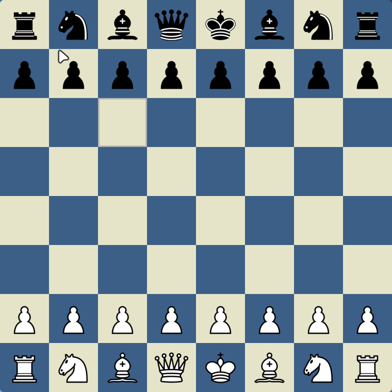

# Chess Repo

Hello everyone. This is my Repo for the chess engine I am making. This is very basic and in the future when I get some time I will edit and optimise the code.

The engine is made using pure python and [pygame](https://www.pygame.org/docs/) was used as the library for sprite rendering. P.s II know the code is super unomptized but I will try to make it better, I just wanted to have something up and running before wokring on it. 

# How to run the code

To run the code download the repo using git

    git clone https://github.com/YASTREAMER/ChessRepo.git

 After downloadin the repo change the directory to the ChessRepo/ChessDep.

    python3 src/main.py

# Themes

The ChessEngine currently has 4 themes but you can add more in the ```src/config.py``` file. Just add the colour in the ``` _add_themes()```  function with the name if your choice.

<details>
  <summary>Screenshots</summary>





</details>

# Refactor

The video which I used as a guide wasnt finished but on futher research I found another Youtuber who did so I would be using his code a guide an implementing things.

# Future Plans
Future plans for this repe includes   
- Creating a script for a Chess Bot. 
- Creating support for FEN notation.
- Fixing the Castling Bug.
- Optimizing the code
- Implementing BitBoard 
- Addding MinMax Algo With alpha beta pruning.

